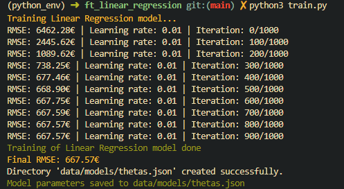
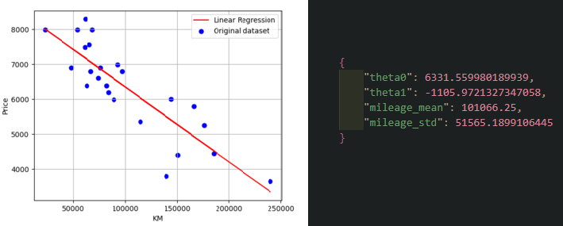
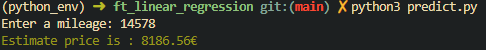

# ft_linear_regression
**Predicting car prices with nothing but a CSV and some formulas. _No polyfit. No magic._ Just gradient descent.**\
*A 42 project and my first dive into machine learning.*

Given mileage and historical sales data, the model estimates a car's resale value using linear regression trained with gradient descent.

## Watch The Model Learn
Here we can see the **RMSE**, the model's prediction error, **dropping iteration by iteration**, until the end of training.



This graph shows the ***regression line fitting the dataset***, minimizing the overall distance to each point. Training also produces a JSON file that ***saves the model parameters and normalization values for prediction.***



Then you can just ***enter any valid number and get your car price***




## Algorithm and Data Flow

The model is a simple affine function **f(x) = ax + b**, trained via **gradient descent** to minimize the **Mean Squared Error** (MSE). Features are normalized with **z-score standardization** before training to ensure stable convergence. Once trained, the model parameters and normalization values are saved to a JSON file for reuse.

## OOP Architecture

The project is structured around abstract **base classes** *(BaseModel, BasePreprocessor, BaseTrainer)*  that define clear interfaces, each implemented by their respective **concrete classes** *(LinearRegression, GradientDescentTrainer, Normalizer)*. </br>**Concerns** are split across dedicated modules *(preprocessing, training, metrics, persistence, and visualization)* making each component **independently testable and reusable**.

## Installing and Usage
This project uses [Python](https://www.python.org/).</br>
Clone the repository and install the dependencies:

```
git clone <repo>
cd ft_linear_regression
pip install -r requirements.txt
```

Train the model and run predictions:
```
python3 train.py    # trains the model and saves parameters to data/models/thetas.json
python3 predict.py  # loads the model and predicts a car price from mileage input
